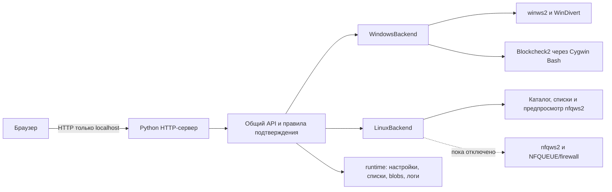

# Архитектура

Zapret2 WebControl использует один веб-интерфейс и общий API. Процессы, службы и сетевые механизмы остаются в платформенном бэкенде.

## Общие компоненты

- `app/zapret2_webcontrol/web/` — статические HTML, CSS, JavaScript и favicon.
- `server.py` — локальный HTTP-сервер и API `/api/v1/...` на стандартной библиотеке Python.
- `backend/base.py` и `backend/factory.py` — общий контракт и выбор адаптера по ОС.
- `strategies.py` и `strategy_catalog.py` — общая модель профиля, каталог и компиляторы команд.
- `strategy_store.py` и `list_store.py` — валидация, локальное хранение и атомарная запись пользовательских данных.
- `reference_importer.py` — преобразование поддерживаемых UCI-блоков в общий формат стратегий.

## Windows-бэкенд

1. Собирает параметры включённых профилей в команду `winws2` с соответствующими Lua-библиотеками, списками, фильтрами и blob-ресурсами.
2. Показывает команду и предупреждения. Перед запуском управляемого процесса выполняет `winws2 --dry-run`; при установке или обновлении службы также предварительно проверяет текущую команду.
3. Запускает процесс или службу только по отдельному подтверждению; службу не запускает, если сохранённая в ней конфигурация устарела.
4. Пишет лог управляемого процесса в `runtime/logs/`; остановка затрагивает только процесс/службу, которой управляет панель.

Bootstrap закрепляет Windows-бандл и проверяет SHA-256 загружаемых ресурсов. Сам сервер панели не меняет firewall автоматически при запуске и не стартует `winws2` без действия пользователя.

## Linux-бэкенд и граница поддержки

Linux-адаптер находит `nfqws2`, обслуживает общий каталог и списки, хранит пользовательские изменения и формирует команду-предпросмотр. Он намеренно **не запускает** `nfqws2` и не устанавливает автозапуск: до интеграции нужны согласованные правила NFQUEUE и nftables/iptables, обработка ошибок и надёжный rollback.

Поэтому общий интерфейс не означает, что обе ОС имеют одинаковые возможности. Панель показывает возможности выбранного бэкенда; на Linux запуск, firewall-правила и Blockcheck2 пока не подключены.

## Хранение

| Каталог | Назначение | В Git |
| --- | --- | --- |
| `app/` | Код приложения | Да |
| `docs/`, `tests/` | Документация и тесты | Да |
| `vendor/` | Полученный Windows-бандл | Нет |
| `runtime/config/` | Overrides и пользовательские профили | Нет |
| `runtime/lists/`, `runtime/blobs/` | Локальные списки и payload | Нет |
| `runtime/logs/` | Рабочие журналы | Нет |

Эталонный каталог стратегий хранится в исходном коде. В `runtime/config/strategies.json` записываются только пользовательские отличия, поэтому обновление кода не перезаписывает локальные настройки.

## API и подтверждение действий

API версионирован префиксом `/api/v1`. Основные ресурсы:

| Маршрут | Назначение |
| --- | --- |
| `/health`, `/system`, `/status` | Связь, возможности бэкенда и статус процесса |
| `/strategies`, `/strategies/preview` | Каталог профилей и предпросмотр команды |
| `/lists` | Просмотр и изменение списков |
| `/logs/runtime` | Журнал управляемого процесса |
| `/blockcheck/*` | Статус, лог и управление Blockcheck2 |
| `/autostart*` | Статус и операции со службой автозапуска |
| `/runtime/start`, `/runtime/stop` | Управление процессом |

Запуск и остановка процесса, сброс профилей, очистка журнала, управление Blockcheck2 и службой требуют поля подтверждения. Создание профиля и изменение списков/параметров сохраняют пользовательские данные через отдельные маршруты. Операции со службой дополнительно проверяют права Windows. Подтверждение не отменяет предупреждения, показанные в интерфейсе.

## Граница безопасности

Сервер по умолчанию привязан к `127.0.0.1` и не реализует аутентификацию. Это локальная панель для доверенного компьютера, а не многопользовательский или сетевой веб-сервис. Не меняйте привязку на `0.0.0.0`, не публикуйте порт через роутер и не ставьте внешний reverse proxy без отдельной реализации аутентификации и защиты от межсайтовых запросов.
